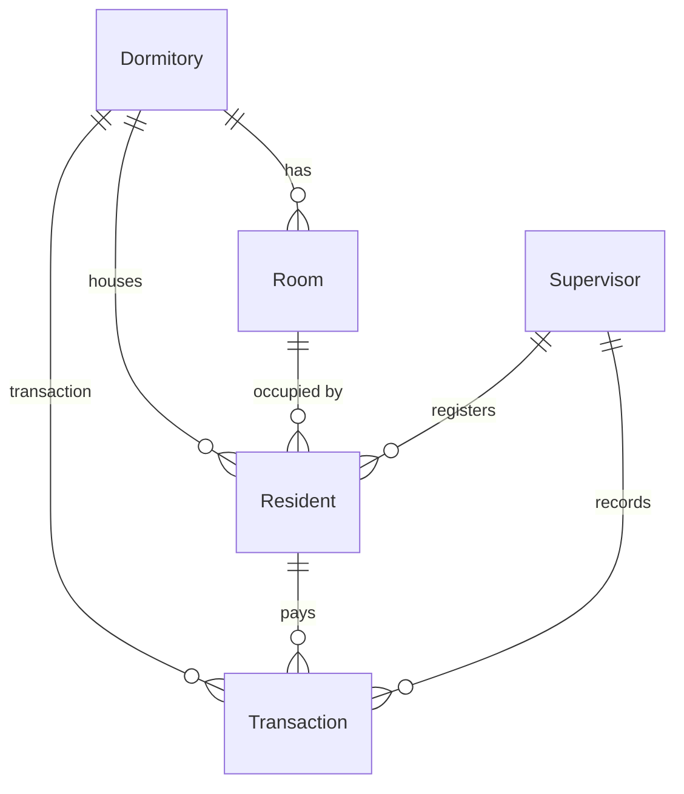

# 🏢 Dormitory Management System

<div align="center">


**Student Dormitory Management System - MVP Version**

A fast, simple, and efficient replacement for paper-based dormitory management

</div>

---

## 📋 Table of Contents

- [🎯 Introduction](#-introduction)
- [✨ Features](#-features)
- [🛠 Tech Stack](#-tech-stack)
- [📊 Data Models](#-data-models)
- [🚀 Installation](#-installation)
- [📁 Project Structure](#-project-structure)
- [🖥 Admin Panel](#-admin-panel)
- [💰 Financial Management](#-financial-management)
- [📦 Archive System](#-archive-system)
- [📈 Reports](#-reports)
- [🔮 Future Roadmap](#-future-roadmap)

---

## 🎯 Introduction

This project is a **Dormitory Management System** designed to quickly replace the current paper-based workflow. All operations are managed through the Django Admin interface with the Jazzmin skin.

> **Goal:** Build a fast, clean, and maintainable MVP that works today and scales tomorrow.

### Why This Project?

- ❌ **Before:** Paper chaos, confusion, no reporting
- ✅ **After:** All data in one panel, real-time stats, transparent history

---

## ✨ Features

### 🏠 Dormitory Management
- Define multiple dormitory buildings
- Real-time statistics (total rooms, occupied, vacant)

### 🏢 Room Management
- Capacity & monthly rent per room
- Color-coded occupancy status 🟢🟡🔴
- Filter by vacancy: full / available / empty
- Auto-conversion between Tomans ↔ Rials

### 👤 Resident Management
- Complete personal info (name, national ID, phone, occupation)
- Entry & exit dates
- Status: Active ✅ / Inactive ⏸ / Left 🚪
- Monthly payment due day
- Settlement date tracking
- Debt status indicator ⚠️
- Inline transaction history on detail page

### 💰 Transaction Management
- Types: Rent 🏠 / Deposit 💰 / Other 📝
- Methods: Cash 💵 / Card 💳 / Bank Transfer 🏦 / Online Gateway 🌐
- Two-step approval for Cash & Bank Transfer ⏳ → ✅
- Beautiful receipt preview 🧾
- Room rate snapshot at payment time (prevents calculation errors)
- Auto-conversion between Million Tomans ↔ Rials

### 📦 Archive System
- Bulk archive residents who have LEFT
- Preserve all transactions in archive
- Remove from main tables for performance

### 📊 Reporting
- Daily card & bank transfer payment report
- Formatted tables with `tabulate`
- Full & compact output modes
- Persian (Jalali) date support

---

## 🛠 Tech Stack

| Technology | Purpose |
|-----------|---------|
| **Python 3.11** | Core language |
| **Django 5.2** | Web framework |
| **PostgreSQL** | Database |
| **Jazzmin** | Modern admin skin |
| **django-jalali-date** | Persian calendar |
| **tabulate** | Report tables |

---

## 📊 Data Models


### Core Entities:

| Model | Description | Key Fields |
|-------|-------------|------------|
| **Dormitory** | Building | `name`, `address` |
| **Room** | Room unit | `room_number`, `capacity`, `monthly_rent` |
| **Resident** | Occupant | `national_code`, `status`, `settled_until` |
| **Transaction** | Financial record | `amount`, `payment_method`, `is_approved`, `applicable_rent` |
| **Supervisor** | Manager | `national_code` |
---

## 🚀 Installation

### Prerequisites

```bash
Python 3.11+
PostgreSQL 16+
```

### Setup Steps

```bash
# 1. Clone the repository
git clone <your-repo-url>
cd dormitory-management

# 2. Create virtual environment
python -m venv venv

# 3. Activate virtual environment
# Windows:
venv\Scripts\activate
# Linux/Mac:
source venv/bin/activate

# 4. Install dependencies
pip install -r requirements.txt

# 5. Configure database in config/settings.py

# 6. Run migrations
python manage.py makemigrations
python manage.py migrate

# 7. Create superuser
python manage.py createsuperuser

# 8. Start server
python manage.py runserver
```

### ⚙️ Important Settings

```python
# config/settings.py
TIME_ZONE = 'Asia/Tehran'
LANGUAGE_CODE = 'en-us'
```

---

## 📁 Project Structure

```
dormitory-management/
│
├── config/                    # Django settings
│   ├── settings.py
│   ├── urls.py
│   └── wsgi.py
│
├── apps/                      # Applications
│   ├── accounts/              # User management (Supervisor)
│   │   ├── models.py          # Supervisor model
│   │   └── admin.py
│   │
│   ├── dormitory/             # Main app
│   │   ├── models/
│   │   │   ├── dormitory.py   # Dormitory model
│   │   │   ├── room.py        # Room model
│   │   │   ├── resident.py    # Resident model
│   │   │   ├── transaction.py # Transaction model
│   │   │   └── supervisor.py  # (moved to accounts)
│   │   ├── admin.py           # Jazzmin admin panel
│   │   └── queries.py         # Report queries
│   │
│   └── archive/               # Left residents archive
│       ├── models.py          # ArchivedResident, ArchivedTransaction
│       └── admin.py
│
├── reports/                   # Report scripts
│   └── daily_card_report.py   # Daily card payment report
│
├── manage.py
├── requirements.txt
└── README.md
```

---

## 🖥 Admin Panel

Access after running:

```
http://127.0.0.1:8000/admin/
```

### Admin Panel Features:

#### 📋 Resident List
- Display: Name, National ID, Occupation, Dormitory, Room, Status, Debt
- Filter: Status, Occupation, Dormitory, Entry Date
- Search: Name, National ID, Phone, Room Number
- Inline transactions on detail page

#### 🏢 Room List
- Display: Dormitory, Room Number, Capacity, Vacancy (🟢 Available / 🔴 Full)
- Filter: Dormitory, Capacity, Vacancy Status

#### 💰 Transaction List
- Display: Receipt #, Resident, Amount, Type, Method, Approval Status
- Filter: Type, Method, Approval, Dormitory, Date
- Bulk Actions: Approve ✅ / Unapprove ❌

---

## 💰 Financial Management

### 🪙 Currency Conversion

| Operation | User Input | Stored in DB | Displayed |
|-----------|-----------|--------------|-----------|
| **Room Rent** | 4 (Million Tomans) | 40,000,000 (Rials) | 4.000M Tomans |
| **Transaction** | 2.5 (Million Tomans) | 25,000,000 (Rials) | 2.500M Tomans |

### ✅ Payment Approval System

| Payment Method | Needs Approval | Notes |
|---------------|---------------|-------|
| 💵 Cash | ✅ Yes | Supervisor must approve |
| 🏦 Bank Transfer | ✅ Yes | Supervisor must approve |
| 💳 Card Payment | 🔵 Auto | No approval needed |
| 🌐 Online Gateway | 🔵 Auto | No approval needed |

### 📎 Room Rate Snapshot

To prevent calculation errors when room prices change:
- Each `RENT` transaction captures the room rate at that moment in `applicable_rent`
- Even if the room price changes 6 months later, old transactions remain intact

---

## 📦 Archive System

Residents whose status is `LEFT` can be archived via **bulk action**:

1. In the resident list, filter by `LEFT` status
2. Select the residents
3. Run the action `📦 Archive selected LEFT residents and their transactions`

✅ **Result:**
- Resident and all their transactions are moved to archive tables
- Removed from main tables
- Data preserved as read-only in archive

---

## 📈 Reports

### Daily Card & Bank Transfer Report

```bash
python reports/daily_card_report.py
```

Output includes:
- 📊 Full transaction list with details (name, amount, time)
- 📋 Formatted tables using `tabulate`
- 📊 Compact version for printing
- 💰 Daily total collection

---

## 🔮 Future Roadmap

- [ ] REST API with Django REST Framework
- [ ] Mobile PWA panel
- [ ] Overdue payment notifications
- [ ] Two-factor authentication
- [ ] Room price change history
- [ ] Advanced reports with charts
- [ ] Payment gateway integration
- [ ] Automated SMS reminders
- [ ] Biometric authentication
- [ ] Digital dormitory bulletin board

---

<div align="center">

**Made with ❤️ for Better Dormitory Management**

[⬆ Back to Top](#-dormitory-management-system)

</div>
```