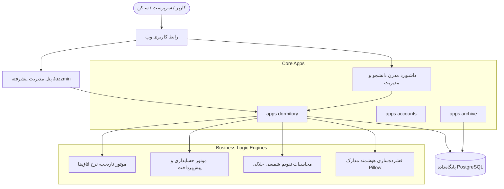
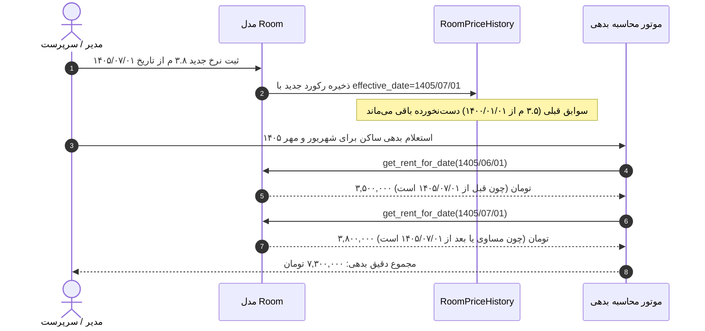
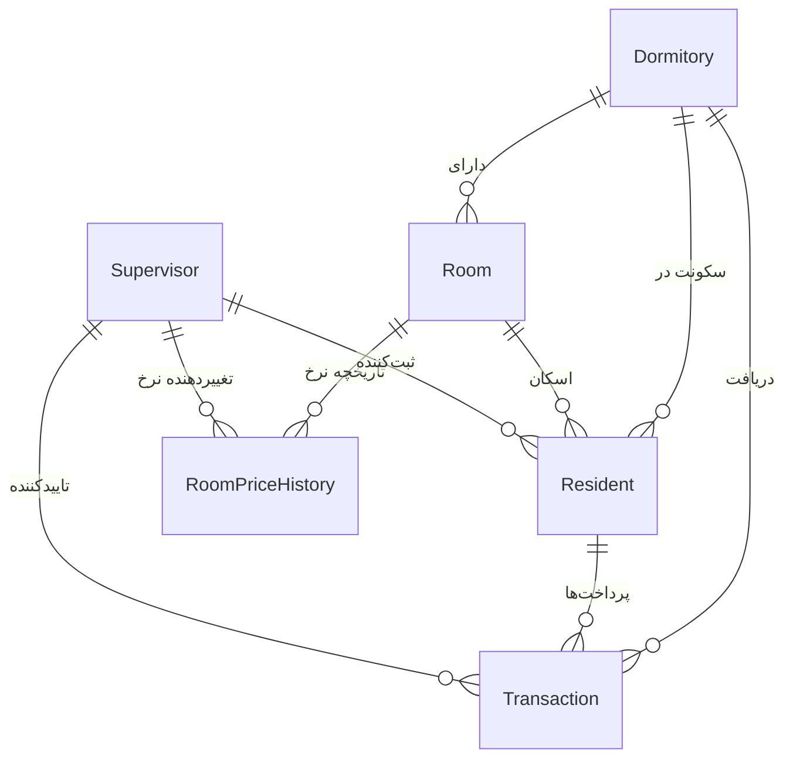
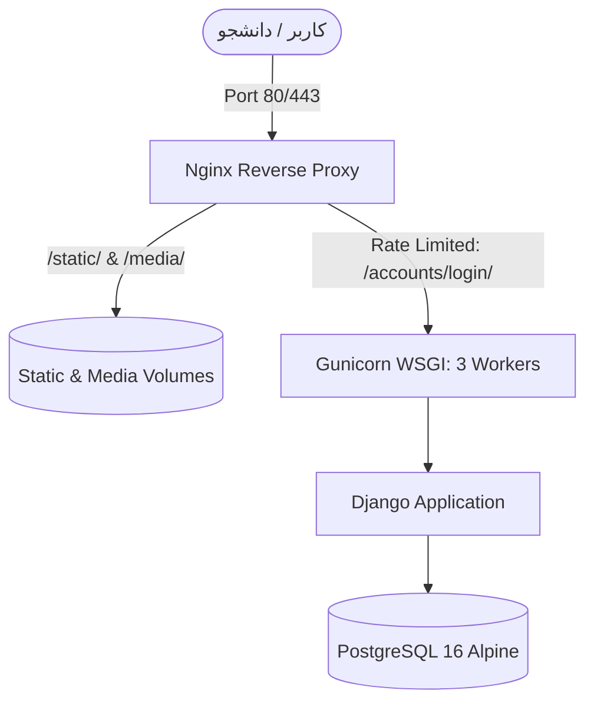

# مستندات فنی و راهنمای جامع معماری سیستم مدیریت خوابگاه (Dormitory Management System)

این سند مرجع فنی و مهندسی کلیه زیرسیستم‌های نرم‌افزار خوابگاه، منطق‌های محاسباتی، معماری پایگاه‌داده و جریان‌های کاری سیستم است. هدف این راهنما شفاف‌سازی کامل نحوه کارکرد سیستم برای توسعه‌دهندگان، مدیران فنی و مسئولین اجرایی خوابگاه می‌باشد.

---

## فهرست مطالب
1. [معماری کلان نرم‌افزار (System Architecture)](#۱-معماری-کلان-نرم‌افزار)
2. [سیستم تاریخچه نرخ اتاق و تغییر قیمت بر اساس تاریخ اعمال (Room Price History Engine)](#۲-سیستم-تاریخچه-نرخ-اتاق-و-تغییر-قیمت-بر-اساس-تاریخ-اعمال)
3. [سیستم حسابداری پیش‌پرداخت، روزشمار و دوره‌های اجاره (Prepaid Accounting & Billing Engine)](#۳-سیستم-حسابداری-پیش‌پرداخت-روزشمار-و-دوره‌های-اجاره)
4. [چرخه حیات تراکنش‌ها، پرداخت‌ها و تسویه خودکار (Transaction Lifecycle)](#۴-چرخه-حیات-تراکنش‌ها-پرداخت‌ها-و-تسویه-خودکار)
5. [سیستم پرونده هویتی، اتباع، فشرده‌سازی تصویر و کسری مدارک (Resident Identity & Documents Engine)](#۵-سیستم-پرونده-هویتی-اتباع-فشرده‌سازی-تصویر-و-کسری-مدارک)
6. [محاسبات بومی تقویم شمسی جلالی (Jalali Date Engine)](#۶-محاسبات-بومی-تقویم-شمسی-جلالی)
7. [رابط کاربری ادمین، تم‌ها و داشبوردها (UI & Dashboard Integrations)](#۷-رابط-کاربری-ادمین-تم‌ها-و-داشبوردها)
8. [پایگاه‌داده، مدل‌ها و پوشش آزمون‌ها (Database, Models & Tests)](#۸-پایگاه‌داده-مدل‌ها-و-پوشش-آزمون‌ها)

---

## ۱. معماری کلان نرم‌افزار

این سامانه به صورت یک برنامه وب متمرکز و یکپارچه بر پایه فریم‌ورک جنگو و پایگاه‌داده PostgreSQL توسعه داده شده است.



### ساختار اپلیکیشن‌ها:
- `apps.dormitory`: هسته اصلی مدیریت خوابگاه‌ها (`Dormitory`)، اتاق‌ها (`Room`, `RoomPriceHistory`)، ساکنین (`Resident`)، تراکنش‌ها (`Transaction`) و یادداشت‌های روزانه (`DailyNote`).
- `apps.dashboard`: ویوها و APIهای داشبورد تک‌صفحه‌ای مدرن، کارت‌های آمار، سیستم تم دوگانه، لیست ساکنین، و مودال‌های جزئیات پرونده.
- `apps.accounts`: احراز هویت و مجوزهای سرپرستان خوابگاه (`Supervisor`).
- `apps.archive`: آرشیو دائمی سوابق افراد خارج‌شده و تراکنش‌های پاک‌شده جهت سبک ماندن جداول عملیاتی اصلی.

---

## ۲. سیستم تاریخچه نرخ اتاق و تغییر قیمت بر اساس تاریخ اعمال

### چالش فنی:
در خوابگاه‌ها اجاره اتاق‌ها ممکن است در طول سال افزایش یابد (مثلاً افزایش اجاره از ۳.۵ میلیون تومان به ۳.۸ میلیون تومان از ابتدای پاییز). در سیستم‌های سنتی، تغییر فیلد `monthly_rent` منجر به خطاهای فاحش زیر می‌شد:
- محاسبات و گزارش‌های ماه‌های گذشته مخدوش می‌شدند.
- افرادی که ماه‌های قبل را تسویه کرده بودند به اشتباه بدهکار می‌شدند یا مبالغ رسیدهای قبلی تغییر می‌کرد.
- بدهی معوق ماه‌های قبل با نرخ جدید حساب می‌شد نه نرخی که در زمان سکونت جاری بوده است.

### راه‌حل پیاده‌سازی‌شده (Effective Date History Pattern):
برای حل ریشه‌ای این مسئله، مدل `RoomPriceHistory` و ساختار تاریخچه موثر پیاده‌سازی شد.



### ساختار مدل `RoomPriceHistory`:
```python
class RoomPriceHistory(models.Model):
    room = models.ForeignKey('dormitory.Room', on_delete=models.CASCADE, related_name='price_history')
    monthly_rent = models.PositiveBigIntegerField(help_text="مبلغ اجاره به ریال")
    effective_date = jmodels.jDateField(help_text="تاریخ شروع اعمال نرخ")
    created_at = models.DateTimeField(auto_now_add=True)
    created_by = models.ForeignKey('accounts.Supervisor', on_delete=models.SET_NULL, null=True, blank=True)
    note = models.CharField(max_length=255, blank=True, default="")
```

### نحوه بازیابی نرخ بر اساس تاریخ (`get_rent_for_date`):
```python
def get_rent_for_date(self, target_date: Optional[jdatetime.date] = None) -> int:
    if target_date is None:
        target_date = jdatetime.date.today()
    
    # واکشی آخرین نرخی که تاریخ اعمال آن قبل یا مساوی تاریخ مورد نظر است
    history = self.price_history.filter(effective_date__lte=target_date).order_by('-effective_date', '-id').first()
    if history:
        return history.monthly_rent

    # در صورتی که تاریخ قبل از همه سوابق باشد، اولین نرخ ثبت‌شده را برمی‌گرداند
    earliest = self.price_history.order_by('effective_date', 'id').first()
    if earliest and target_date < earliest.effective_date:
        return earliest.monthly_rent

    return self.monthly_rent
```

### تغییر نرخ دسته‌جمعی اتاق‌ها (`bulk_change_price`):
در پنل ادمین جنگو، اکشن اختصاصی `bulk_change_price` امکان انتخاب ده‌ها اتاق به صورت همزمان، تعیین نرخ جدید، تاریخ اجرا و علت تغییر نرخ را در قالب یک فرم استاندارد و تأییدیه دو مرحله‌ای فراهم می‌کند.

---

## ۳. سیستم حسابداری پیش‌پرداخت، روزشمار و دوره‌های اجاره

سامانه به طور کامل بر پایه **مدل پیش‌پرداخت (Prepaid)** فعالیت می‌کند؛ یعنی اجاره هر ماه در شروع دوره ماهانه دریافت می‌شود، نه در پایان آن.

### مفاهیم پایه حسابداری:
1. **`entry_date` (تاریخ ورود)**: تاریخی که ساکن وارد خوابگاه شده است.
2. **`settled_until` (تسویه تا تاریخ)**: مرز زمانی تسویه‌شده ساکن. تا این تاریخ هیچ بدهی‌ای وجود ندارد.
3. **`next_due_date` (سررسید موعد بعدی)**: برابر است با مقدار `settled_until` (یا `entry_date` برای افرادی که هنوز پرداختی نداشته‌اند).
4. **`is_in_debt` (وضعیت بدهکاری)**:
   - اگر `settled_until` خالی باشد و `today >= entry_date`، ساکن بدهکار است.
   - اگر `settled_until` ثبت شده باشد و `today >= settled_until`، ساکن بدهکار است.
   - اگر `today < settled_until`، حساب کاملاً به روز و تسویه است.
5. **`overdue_days` (شمارنده روزهای تاخیر)**:
   $$\text{overdue\_days} = \max(0, (\text{today} - \text{settled\_until}).\text{days})$$
6. **`debt_urgency` (سطح اضطرار بدهی)**:
   - `'settled'`: تسویه به روز (`is_in_debt == False`)
   - `'warning'`: تاخیر ۱ تا ۷ روز (مهلت هفتگی ارفاق جهت پرداخت با رنگ هشدار زرد)
   - `'danger'`: تاخیر بالای ۷ روز (بدهکاری قطعی با رنگ هشدار قرمز)

### تفکیک دوره‌های ماهانه معوقه (`calculate_unpaid_periods`):
اجاره در سیستم به صورت **مقطوع ماهانه** محاسبه می‌شود (نه جریمه روزشمار خرد). این متد از تاریخ `settled_until` تا تاریخ جاری ماه به ماه جلو می‌رود و با فراخوانی `rent_resolver`، نرخ مصوب همان مقطع زمانی را استخراج می‌کند:

```python
# خروجی هر دوره به شکل زیر است:
{
    "start_date": jdatetime.date(1405, 6, 1),
    "end_date": jdatetime.date(1405, 7, 1),
    "name": "اجاره شهریور ماه ۱۴۰۵",
    "overdue_days": 25,
    "amount_rials": 35000000,
    "amount_tomans": 3500000
}
```

### محاسبه بدهی ترکیبی چندنرخی:
مجموع بدهی ساکن با فرمول زیر به دست می‌آید:
```python
@property
def total_debt_amount_tomans(self) -> int:
    return sum(p["amount_tomans"] for p in self.unpaid_periods)
```
این ساختار تضمین می‌کند که اگر اتاقی دستخوش چندین مرحله افزایش قیمت شود، هر ماه منحصراً با نرخ قانونی همان ماه فاکتور شود.

---

## ۴. چرخه حیات تراکنش‌ها، پرداخت‌ها و تسویه خودکار

مدل `Transaction` یک رکورد غیرقابل دستکاری (Immutable) از پرداخت‌های مالی است.

### انواع تراکنش و روش‌های پرداخت:
- **`transaction_type`**:
  - `RENT`: اجاره ماهانه
  - `DEPOSIT`: ودیعه مسکن
- **`payment_method`**:
  - `CARD`: کارتخوان متصل به حساب
  - `ONLINE_GATEWAY`: درگاه پرداخت آنلاین
  - `CASH`: وجه نقد (نیازمند تایید سرپرست)
  - `BANK_TRANSFER`: کارت‌به‌کارت / حواله پایا (نیازمند تایید سرپرست با رسید)

### فیلد `applicable_rent`:
هنگام ثبت یک تراکنش از نوع اجاره، نرخ ماهانه فعال اتاق در لحظه پرداخت یا دوره اجاره در فیلد `applicable_rent` ذخیره می‌شود. این فیلد برای همیشه نرخ آن پرداخت را فریز می‌کند و مانع از آن می‌شود که افزایش قیمت‌های بعدی اتاق، رسیدهای صادره را تغییر دهند.

### تایید خودکار و جلوبردن تاریخ تسویه (`advance_settlement`):
زمانی که یک پرداخت اجاره ثبت و تایید می‌شود (`is_approved=True`):
```python
if self.is_approved and self.transaction_type == self.TransactionType.RENT and self.period_end:
    res = self.resident
    if res and (not res.settled_until or self.period_end > res.settled_until):
        res.settled_until = self.period_end
        res.save(update_fields=['settled_until'])
```
این قلاب (Hook) به صورت خودکار سررسید ساکن را به اندازه ماه‌های پرداخت‌شده به جلو هدایت می‌کند.

---

## ۵. سیستم پرونده هویتی، اتباع، فشرده‌سازی تصویر و کسری مدارک

### پشتیبانی بومی از اتباع خارجی (`is_foreign`):
- فیلد دودویی `is_foreign`: مشخص می‌کند ساکن تبعه غیرایرانی است.
- در صورت انتخاب گزینه اتباع، نیازمندی فرمت ۱۰ رقمی کد ملی برداشته شده و فیلد برای ثبت **شماره پاسپورت** یا **کد اختصاصی فراگیر** آزاد می‌شود.

### فیلد نام پدر (`father_name`):
نام پدر به عنوان بخش حیاتی قراردادهای سکونت و احراز هویت به مدل افزوده شده است و سیستم مقادیر پوچ یا کلمات نامعتبر مثل «ندارد»، «-» و «فاقد» را در مرحله اعتبارسنجی (`clean`) به صورت خودکار پاکسازی می‌کند.

### فشرده‌سازی خودکار و آپلود تا ۳ تصویر مدرک شناسایی:
- فیلدهای `id_card_image` (روی مدرک/پاسپورت)، `id_card_image_2` (پشت مدرک/صفحه دوم)، و `id_card_image_3` (شناسنامه/مدرک تکمیلی).
- با استفاده از کتابخانه `Pillow` در فایل `apps/dormitory/image_utils.py`، کلیه تصاویر ورودی چه از دوربین موبایل و چه فایل‌های سنگین، بدون افت کیفیت متن و وضوح تصویر به زیر **۱ مگابایت** فشرده و به ابعاد استاندارد تغییر مقیاس پیدا می‌کنند.

### موتور رهگیری کسری مدارک (`IncompleteProfileFilter`):
سیستم به صورت خودکار ۵ فاکتور اصلی پرونده را مانیتور می‌کند:
1. کد ملی یا شماره پاسپورت (`national_code`)
2. نام پدر (`father_name`)
3. تلفن تماس والدین یا سرپرست (`parent_phone_number`)
4. داشتن اجاره‌نامه (`has_lease`)
5. حداقل یک تصویر بارگذاری‌شده از مدارک (`has_id_card_image`)

در صورت فقدان هر یک، وضعیت نقص در بج‌های ادمین، فیلترهای کناری و داشبورد نمایش داده می‌شود.

### سیستم کپی و خروجی مشخصات بدون داده‌های مالی:
جهت اشتراک‌گذاری مشخصات فردی با دانشگاه، حراست یا هم‌اتاقی‌ها، تابع `get_export_text` خروجی تمیز فارسی شامل مشخصات، اتاق، تخت، شماره تماس، و وضعیت مدارک را بدون انتشار تاریخچه پرداخت‌ها و مبالغ در کلیپ‌بورد کپی می‌کند.

---

## ۶. محاسبات بومی تقویم شمسی جلالی

یکی از حساس‌ترین بخش‌های فنی، محاسبات دقیق روزهای ماه و سال‌های کبیسه در تقویم هجری شمسی است که در فایل `apps/dormitory/jalali_utils.py` مدیریت می‌شود.

### تابع افزودن ایمن ماه‌های شمسی (`add_jalali_months`):
در تقویم شمسی، ۶ ماه اول ۳۱ روزه، ۵ ماه دوم ۳۰ روزه و ماه اسفند ۲۹ روزه (یا ۳۰ روزه در سال کبیسه) است. اگر ساکنی در تاریخ ۳۱ اردیبهشت وارد شده باشد، با اضافه شدن ۱ ماه نباید با خطای تاریخ نامعتبر مواجه شویم:
```python
def add_jalali_months(orig_date: jdatetime.date, months: int = 1) -> jdatetime.date:
    total_months = (orig_date.year * 12) + (orig_date.month - 1) + months
    new_year = total_months // 12
    new_month = (total_months % 12) + 1

    max_days = get_days_in_jalali_month(new_year, new_month)
    new_day = min(orig_date.day, max_days)
    return jdatetime.date(new_year, new_month, new_day)
```

### نام‌گذاری هوشمند دوره‌ها (`format_period_name`):
- دوره اول ماه: `۱۴۰۵/۰۷/۰۱` تا `۱۴۰۵/۰۸/۰۱` $\rightarrow$ **«اجاره مهر ماه ۱۴۰۵»**
- دوره‌های چندماهه: `۱۴۰۵/۰۷/۰۱` تا `۱۴۰۵/۰۹/۰۱` $\rightarrow$ **«اجاره مهر و آبان ماه ۱۴۰۵»**
- دوره‌های میان‌ماهی: `۱۴۰۵/۰۷/۱۵` تا `۱۴۰۵/۰۸/۱۵` $\rightarrow$ **«اجاره دوره ۱۵ مهر تا ۱۵ آبان ۱۴۰۵»**

---

## ۷. رابط کاربری ادمین، تم‌ها و داشبوردها

1. **پنل مدیریت Jazzmin**:
   - شخصی‌سازی‌شده برای زبان فارسی و راست‌چین (RTL).
   - ابزارک اختصاصی تقویم پاپ‌آپ شمسی (`AdminPersianDateWidget`).
   - اکشن‌های سفارشی: تغییر دسته‌جمعی نرخ اتاق‌ها، خروجی کلیپ‌بورد، خروجی اکسل/CSV، و آرشیو افراد خارج‌شده.
2. **داشبورد تک‌صفحه‌ای (`apps/dashboard`)**:
   - **جستجوی پیشرفته و زنده اتاق‌ها در تب اتاق‌ها (`#search-room`)**: امکان جستجوی لحظه‌ای اتاق بر اساس شماره اتاق (به صورت ارقام فارسی یا انگلیسی، مثل «۱۰۲» یا «102» یا «اتاق ۱۰۲»)، نام ساکنین حاضر در اتاق و خوابگاه، به همراه شمارنده داینامیک اتاق‌های منطبق (`#rooms-count`).
   - **فیلتر و جستجوی اتاق در تب دانشجوها**: افزودن منوی کشویی اختصاصی انتخاب اتاق (`#filter-room-select`) برای نمایش ساکنین یک اتاق خاص، به همراه پشتیبانی نوار جستجوی دانشجو از شماره اتاق‌ها.
   - دارای سوییچر تم پیشرفته (Classic Dark و Modern Slate) با افکت‌های گلس‌مورفیسم.
   - کارت‌های آماری داینامیک: تعداد کل اتاق‌ها، اتاق‌های دارای تخت خالی، تعداد بدهکاران، درآمد ماه جاری و کسری مدارک.
   - مودال تعاملی نمایش ریز مشخصات و وضعیت پرونده با تفکیک دوره‌های بدهی.

---

## ۸. پایگاه‌داده، مدل‌ها و پوشش آزمون‌ها

### رابطه میان موجودیت‌ها (ER Diagram):



### اجرای تست‌های خودکار:
تمام منطق‌های محاسباتی، انجماد تراکنش‌ها و گذر نرخ‌های تاریخی تحت آزمون‌های واحد و یکپارچگی قرار دارند:
```powershell
# اجرای تست‌های واحد و اعتبارسنجی هسته سیستم:
venv\Scripts\python.exe manage.py test apps.dormitory --noinput
```

**وضعیت تست‌ها:**
- تعداد تست‌ها: **۶۲ آزمون کامل**
- نرخ موفقیت: **۱۰۰٪ (OK)**
- زمان اجرا: حدود ۱۲ ثانیه


---

## ۹. زیرساخت احراز هویت دانشجویان و معماری استقرار پروداکشن (Docker & Deployment)

### ۱. معماری احراز هویت دانشجویان (`apps/accounts`):
- **اتصال مدل Resident به User جنگو**: فیلد `user = OneToOneField(User, ...)` در مدل `Resident` تضمین می‌کند هر ساکن دارای یک حساب کاربری اختصاصی است.
- **بک‌اند احراز هویت `NationalCodeOrPhoneBackend`**: ساکنین می‌توانند هم با **کد ملی** (یا شماره پاسپورت برای اتباع) و هم با **شماره همراه** خود وارد شوند. ارقام فارسی کیبوردها به صورت خودکار نرمال‌سازی می‌شوند.
- **تفکیک دسترسی و جلوگیری قطعی از IDOR**: هر دانشجو صرفاً اطلاعات، قرارداد و رسیدهای خود را در `/dashboard/student/` دریافت می‌کند. دسترسی به پنل مدیریت `/dashboard/admin/` محدود به ادمین‌ها و سرپرستان است.
- **همگام‌سازی دسته‌ای**: با دستور `python manage.py setup_resident_accounts` حساب‌های تمام ساکنین با موفقیت ایجاد و متصل شده‌اند.

### ۲. معماری استقرار پروداکشن (Production Stack):


- **کانتینر داکر**: ساختار چندکانتینری شامل `db` (PostgreSQL 16)، `web` (پایتون ۳.۱۲ با کاربر غیر روت `appuser`) و `nginx` (پروکسی معکوس و کش استاتیک).
- **حفاظت ضد Brute-Force**: اعمال Rate Limiting به میزان حداکثر ۵ درخواست در دقیقه روی مسیر ورود در Nginx.
- **سرو استاتیک و رسانه**: کش ۳۶۵ روزه استاتیک و پشتیبانی از WhiteNoise به عنوان لایه دوم.
- **راهنمای جامع استقرار**: مستندات کامل عملیاتی در فایل [DEPLOYMENT.md](file:///d:/projects/Dormitory%20Management%20System/dormitory-management/DEPLOYMENT.md) قرار داده شده است.

---

## نتیجه‌گیری و راهنمای نگهداری
این سیستم با تفکیک دقیق لایه‌ها، مدل‌سازی تاریخی داده‌ها و رعایت استانداردهای Clean Architecture طراحی شده است. برای اعمال هرگونه سیاست جدید قیمت‌گذاری یا توسعه ماژول‌های حسابداری، تکیه بر متدهای تست‌شده `get_rent_for_date` و `calculate_unpaid_periods` سلامت داده‌ها را در بالاترین سطح تضمین می‌نماید.

